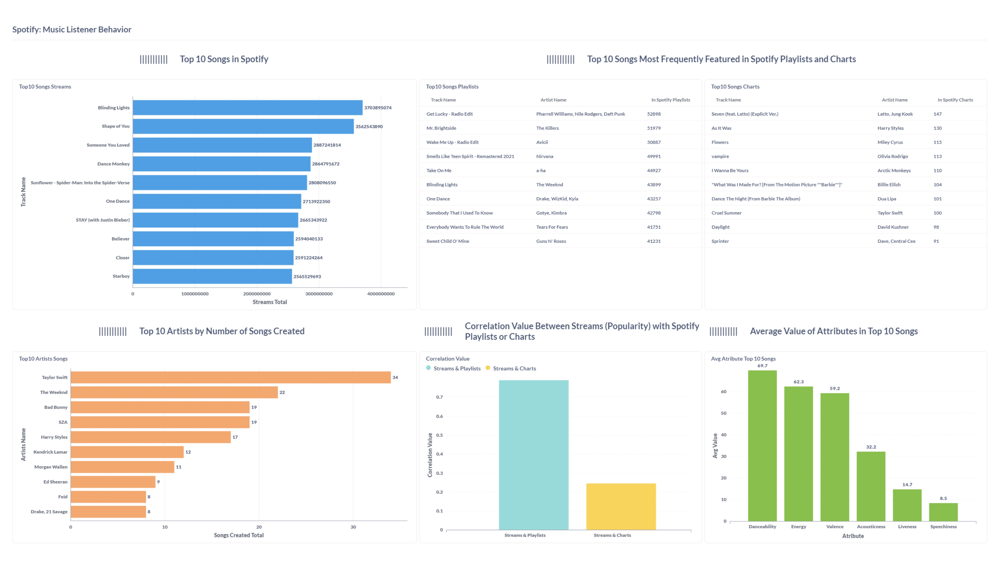

# Spotify: Music Listener Behaviour
## ETL with PySpark, Airflow, Docker

This repository is used to explain my project, which aims to create a dashboard providing more comprehensive information. As we know, music has become an integral part of human culture and life. The music that is currently popular reflects the era and culture nowadays. However, information about the preferences or behaviors of music listeners is not always easily accessible. Therefore, this project aims to provide comprehensive information about music listener behavior.

## Requirements
- Install Make ~ `sudo apt install make`
- Install Docker Compose ~ `sudo apt install docker-compose`
- Install Docker App [Instal Docker](https://docs.docker.com/engine/install/)

---
```
## docker-build	      - Build Docker Images (amd64) including its inter-container network.
## docker-build-arm   - Build Docker Images (arm64) including its inter-container network.
## postgres           - Run a Postgres container
## spark              - Run a Spark cluster, rebuild the postgres container, then create the destination tables
## airflow            - Spinup airflow scheduler and webserver.
## metabase           - Run a Metabase container for visualization
## clean              - Cleanup all running containers related to the challenge.
```
---

## Instruction
1. Clone This Repo.
2. Run `make docker-build` for x86 user, or `make docker-build-arm` for arm chip user.
3. Run `make postgres`
4. Run `make spark`
5. Run `make airflow`
6. Run `make metabase`
7. Wait until all container are ready, especially with the airflow container.
8. Open the airflow on your favorite browser http://localhost:8081/
9. Run the DAG `Spotify: Music Listener Behavior`.
10. After the task running succesfully, you can go to the http://localhost:3000/ on your favorite browser.
11. Visualize the data.


## Data Pipeline Summary
- Collect raw data from kaggle.com.
- Dockerize Postgres, Spark master and worker, Airflow worker and scheduler, and Metabase.
- Create a Spark script named `ETL.py` to extract, transform, and load the data into the database.
- Create a Spark script named `AnalisisSpotify.py` to analyze data from the cleaned database and store the analysis results back into the database.
- Create a DAG named `final_project_day.py` to run both Spark scripts.
- Before running the task, prepare the PostgreSQL JAR file for connecting to the database.
- Visualize the results of the analysis using Metabase.

## File Presentation
[Spotify: Music Listener Behavior](https://www.canva.com/design/DAFx2UoDeAM/y01IcQ7w_Ue8kIQVwrDdYQ/view?utm_content=DAFx2UoDeAM&utm_campaign=designshare&utm_medium=link&utm_source=editor)

`Owner : Mochamad Ananda Radya Mikola`
